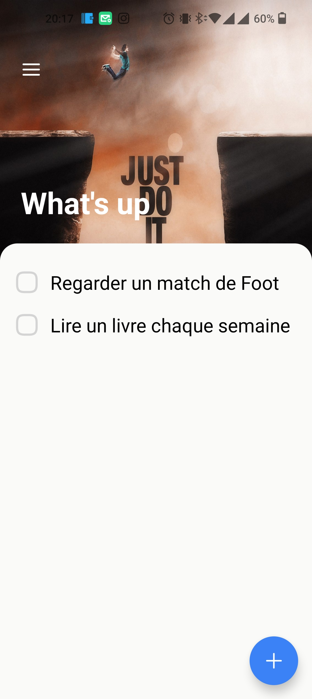
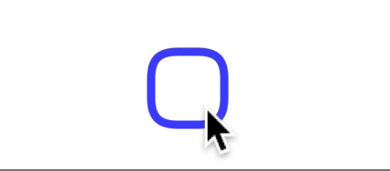

# Smoothly Animated ToDo App built with React Native



Try it in Expo  on [](https://expo.dev/@brahim360/animated-todo)
Try in on  play store [](https://play.google.com/store/apps/details?id=com.mahioussi.todo)

<!-- The animated checkbox component has been published as [an NPM module `react-native-checkbox-reanimated`](https://github.com/craftzdog/react-native-checkbox-reanimated).

 -->

## Stack

- [React Native](https://reactnative.dev/) - ReactJS-based framework that can use native platform capabilities
- [Expo](https://expo.dev/) - Toolset for building and delivering RN apps
- [React Navigation(v6)](https://reactnavigation.org/) - Routing and navigation
- [NativeBase(v3)](https://nativebase.io/) - Themable component library
- [React Native Reanimated](https://docs.swmansion.com/react-native-reanimated/) - Animations
- [React Native SVG](https://github.com/react-native-svg/react-native-svg) - Drawing SVG
- [Moti](https://moti.fyi/) - Helper module for Reanimated 2 

## Project structure

```
$PROJECT_ROOT
├── App.tsx        # Entry point
└── src
    ├── screens    # Screen components
    ├── components # UI components
    ├── utils      # Custom hooks and helpers
    └── assets     # Image files
```

## How to dev

This project can be run from the Expo client app.

```sh
yarn
yarn start
```

